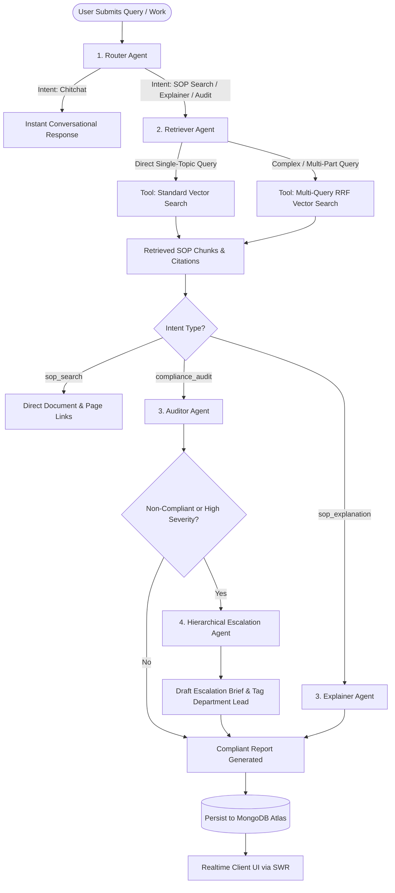
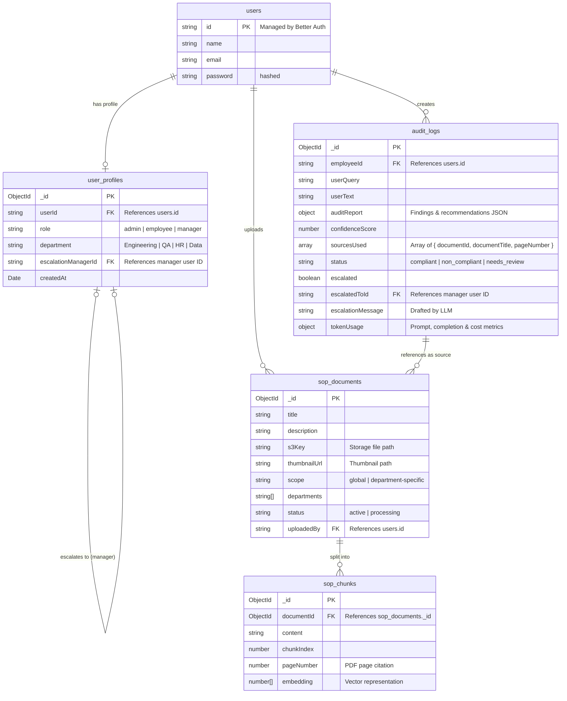

# PolicyGuard 🛡️
### Autonomous Multi-Agent SOP Compliance, Search & Verification Platform

> **PolicyGuard** is an enterprise AI platform that eliminates the friction of discovering, interpreting, and enforcing Standard Operating Procedures (SOPs). Built with **Next.js 16**, **Inngest AgentKit**, and **MongoDB Atlas Vector Search**, PolicyGuard enables employees to query company policies in natural language, verify submitted work for compliance, and receive instant, page-cited audit reports.

---

## 🌟 The Problem & Solution Overview

### The Real-World Challenge
1. **Employees Rarely Read Dense SOP PDFs**: Navigating 50-page legal, security, and operational guideline documents slows down execution and leads to unintentional compliance violations (e.g., missed code review checkpoints, unrotated credentials, improper data access).
2. **Traditional Search Fails on Ambiguity**: Keyword search cannot understand vague, cross-departmental, or multi-faceted questions (e.g., *"What is the mandatory timeframe and procedure if an API credential is leaked?"*).
3. **Lack of Automated Work Verification**: Managers spend hours manually auditing whether an employee's process followed corporate SOPs, creating operational bottlenecks.

### The PolicyGuard Solution
PolicyGuard acts as an autonomous AI compliance officer within the company:
- **Instant Natural Language Answers**: Employees ask questions and receive clear, bulleted answers grounded strictly in company documents.
- **Page-Level Verified Citations**: Every finding and recommendation cites the exact document title and PDF page number for auditable proof.
- **Automated Work Auditing**: Employees can paste work summaries or PR descriptions to receive a structured compliance audit (`compliant`, `non_compliant`, or `needs_review`).
- **Hierarchical Escalation**: When severe non-compliance or security risks are detected, the system automatically identifies the employee's department manager and drafts an executive intervention brief.

---

## 🛠️ Technology Stack & Complexity

PolicyGuard is engineered as a unified, full-stack application leveraging modern cloud-native tools:

| Domain | Technology / Library | Purpose & Implementation |
| :--- | :--- | :--- |
| **Framework** | **Next.js 16 (App Router)** | Full-stack server components, route handlers, server actions, and layout composition. |
| **UI & Styling** | **React 19 & Tailwind CSS** | Liquid glassmorphic dark mode UI, micro-animations, and responsive layout. |
| **Agent Orchestration** | **Inngest AgentKit (`@inngest/agent-kit`)** | Autonomous multi-agent networks, state routing, and dynamic tool invocation. |
| **Durable Execution** | **Inngest SDK (`inngest`)** | Event-driven background job queues, step-based memoization, retries, and throttling. |
| **Client Data Fetching** | **SWR (`swr`)** | Reactive polling, optimistic UI updates, and instant cached tab transitions. |
| **LLM & Embeddings** | **Google Gemini 2.5 Flash** & **LangChain** | Semantic reasoning via `@langchain/google-genai` and text splitting via `@langchain/textsplitters`. |
| **Vector Search** | **MongoDB Atlas Vector Search** | Native vector indexing, $k$-NN search, and document chunk storage. |
| **Document Storage** | **Dual S3 & Cloudinary Support** | Modular storage layer with dynamic presigned URL generation. |
| **Authentication & RBAC** | **Better Auth** | Session management, role-based access control (Admin, Employee), and isolated Guest demo sessions. |
| **Type Safety** | **TypeScript & Zod** | End-to-end type safety, runtime schema validation, and structured JSON agent outputs. |

---

## 🤖 Multi-Agent Architecture (Inngest AgentKit)

PolicyGuard coordinates a network of specialized autonomous agents. Each agent is responsible for a dedicated stage of the compliance workflow:



### Agent Roles & Specialized Tools:

1. **Router Agent (`inngest/agents/router-agent.ts`)**:
   - Classifies the incoming message into one of four intent classes: `compliance_audit`, `sop_explanation`, `sop_search`, or `chitchat`.

2. **Retriever Agent (`inngest/agents/retriever-agent.ts`)**:
   - Equipped with two retrieval tools utilizing LangChain's `@langchain/google-genai` embedding model:
     - **Tool A: Standard Vector Search (`search_sop_chunks`)**: Performs cosine similarity search for direct, single-topic queries.
     - **Tool B: Multi-Query Reciprocal Rank Fusion (`search_sop_chunks_rrf`)**: Deconstructs vague or multi-departmental queries into 2–5 sub-queries, executes parallel vector searches, and merges rankings using Reciprocal Rank Fusion ($k = 60$):
       $$\text{RRF Score}(d) = \sum_{q \in Q} \frac{1}{k + \text{rank}(q, d)}$$
       This eliminates single-query semantic drift and guarantees high retrieval precision.

3. **Explainer Agent (`inngest/agents/explainer-agent.ts`)**:
   - Synthesizes retrieved policy chunks into clear, plain-English answers with bullet points and exact PDF page citations.

4. **Auditor Agent (`inngest/agents/auditor-agent.ts`)**:
   - Evaluates the user's submitted work against SOP rules and produces a structured JSON report with status (`compliant`, `non_compliant`, `needs_review`), confidence score, granular findings, and remediation steps.

5. **Hierarchical Escalation Agent (`inngest/agents/escalation-agent.ts`)**:
   - Triggers when high-severity non-compliance is detected. Queries the organizational database for the user's manager hierarchy, tags the department head, and drafts an executive intervention brief.

---

## ⚡ Engineering Deep-Dive: Why Inngest & Event-Driven Architecture?

### 1. The Serverless Timeout Problem (Vercel Node Runtime)
The goal was to deploy PolicyGuard as a unified Next.js application on **Vercel** without maintaining separate background worker servers. However, Vercel enforces strict execution limits (e.g. a 5-minute maximum runtime).

**The Challenge with Large Documents**:
- Extracting text, generating embeddings for a 100-page SOP PDF, and running multi-step agent reasoning loops in a standard synchronous HTTP route causes gateway timeouts (`504`) and dropped requests.

**How Inngest Solves This with Step-Based Batching**:
- In [`inngest/functions/process-document.ts`](/inngest/functions/process-document.ts), document processing is divided into discrete, memoized steps:
  1. `download-and-extract-chunks`: Parses PDF pages, splits text with LangChain, and initializes chunk records in MongoDB.
  2. `process-batch-${batchIndex}`: Iterates through chunks in batches of 20, generating embeddings and updating MongoDB.
- **Durable Checkpoints & Retries**: If external AI APIs rate-limit on batch 4, Inngest automatically retries *only* batch 4. It never restarts from scratch, guaranteeing 100% completion regardless of document size or Vercel timeouts.

---

### 2. Asynchronous Non-Blocking User Experience
- Submitting an audit query (`POST /api/chat`) enqueues an `audit/query.submitted` event to Inngest in **under 50ms**.
- The client receives an immediate confirmation without freezing the UI. The multi-agent workflow runs asynchronously in the background while the frontend uses **SWR reactive polling** to reflect step-by-step progress.

---

### 3. Concurrency Control & Gemini Rate-Limit Protection
- Google Gemini API accounts enforce Requests-Per-Minute (RPM) limits.
- In [`inngest/functions/compliance-audit.ts`](/inngest/functions/compliance-audit.ts), we configure:
  - `concurrency: 5`: Limits concurrent multi-agent executions to 5 parallel instances, queueing excess queries safely and preventing `429 Too Many Requests` API errors.
  - `throttle: { limit: 25, period: "1m" }`: Smooths out burst query submissions.

---

### 4. Agent Observability & Telemetry (LangSmith Alternative)
Similar to LangSmith or Arize Phoenix, Inngest provides full agent execution observability out of the box:
- **Visual Step Traces**: Inspect every agent's thought process, tool invocations, inputs, and outputs directly in the Inngest Dashboard (`http://localhost:8288` or Inngest Cloud).
- **Live Token & Cost Analytics**: The built-in Admin Analytics tab tracks real-time prompt tokens, completion tokens, estimated USD costs, and department breakdown charts computed directly from live MongoDB audit logs.

---

## 🗄️ Database Schema



---

## 🚀 Getting Started Locally

### 1. Prerequisites
- **Node.js**: `20+`
- **MongoDB Atlas**: Cluster with Vector Search index enabled.
- **Google Gemini API Key**: For model inference and embeddings.
- **Storage Provider**: Cloudinary account (recommended default) or AWS S3 bucket.

### 2. Installation
```bash
git clone https://github.com/NINAD-17/Policy-Guard.git
cd Policy-Guard
npm install
```

### 3. Environment Configuration
Copy the example environment file:
```bash
cp .env.example .env
```

Open `.env` and configure your credentials.

#### Choosing Your Storage Provider:
PolicyGuard supports both **Cloudinary** and **AWS S3** out of the box via the `STORAGE_PROVIDER` variable:
- **To use Cloudinary (Default / Zero setup)**:
  ```env
  STORAGE_PROVIDER="cloudinary"
  CLOUDINARY_CLOUD_NAME="your_cloud_name"
  CLOUDINARY_API_KEY="your_api_key"
  CLOUDINARY_API_SECRET="your_api_secret"
  ```
- **To use AWS S3**:
  ```env
  STORAGE_PROVIDER="s3"
  AWS_ACCESS_KEY_ID="your_access_key"
  AWS_SECRET_ACCESS_KEY="your_secret_key"
  AWS_REGION="ap-south-1"
  AWS_S3_BUCKET_NAME="your_bucket_name"
  ```

---

### 4. Running Locally

Start the Next.js development server and the Inngest Dev Server in separate terminal windows:

**Terminal 1 (Next.js Application)**:
```bash
npm run dev
```

**Terminal 2 (Inngest Local Dev Server)**:
```bash
npx inngest-cli@latest dev -u http://localhost:3000/api/inngest
```

- **Web Application**: [http://localhost:3000](http://localhost:3000)
- **Inngest Execution Dashboard**: [http://localhost:8288](http://localhost:8288)

---

## 🧪 Live Demo & Guest Testing

You can explore PolicyGuard immediately on the **live deployed application** without any local installation or configuration:

1. Open the live deployment link and click **"Sign in as Guest"** on the landing page (no credentials required).
2. **SOP Chat (`/dashboard`)**: Ask natural language policy questions or tap the suggested prompt chips.
3. **Interactive Demo Feed (`/dashboard/demo`)**: Inspect pre-computed interactive audit reports, view citations, and click **"View PDF"** to open verified source pages.
4. **Admin Analytics (`/admin`)**: Explore live LLM token tracking, estimated cost metrics, and real-time MongoDB telemetry.

*(Note: Guest demo mode is also fully accessible when running the project locally.)*

---

## 📄 License
MIT License. Built with ❤️ for autonomous AI compliance engineering.
